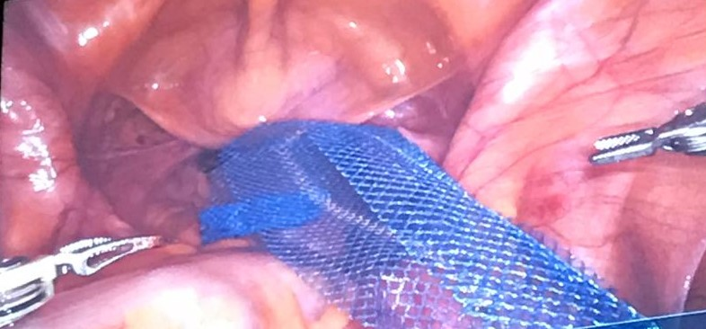

```{r setup, include=FALSE}
knitr::opts_chunk$set(echo = FALSE)
```

Distill is a publication format for scientific and technical writing, native to the web.

Learn more about using Distill at <https://rstudio.github.io/distill>.

E se eu escrever qq coisa , tipo Pode CQD.

`usethis::use_git()`

Colocar link : [Site Ricardo](drricardosouza.com.br)

## Listas

### Lista não numerada:

-   Eu
    - Sou mais eu
-   Nós
-   A gente

### Lista numerada:

1.  Eu
    a. Sou mais eu
    a. Sou mermu
2.  Nós
3.  A gente

## Imagens



## Código em linha

Hoje é dia `r format(Sys.Date(), "%d de %B de %Y")`.


